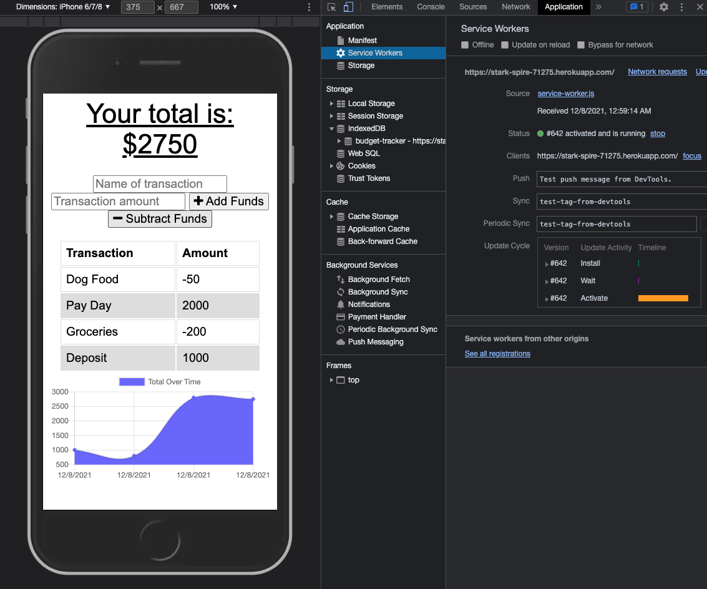

    
# PWA Conversion (Budget Tracking Application Example)

## License

## Description
    
Took a budget tracking app that uses MongoDB and an Express.js server, and converted it to a progressive web app using a service worker, IndexedDB, and a manifest.json file for user installation to their local machine.

## Table of Contents

* [Installation](#installation)
* [Usage](#usage)
* [Credits](#credits)
* [License](#license)
* [Tests](#tests)
* [Questions](#questions)
    
## Installation

Navigate to the application URL in your browser and click 'install app' from the search bar

## Deployment

[Budget-Tracker](https://stark-spire-71275.herokuapp.com/)

## Usage

The budget tracker app is a simplistic user interface where transactions can be added or subtracted from a user running total, even when the app is offline

## Screenshot

## Credits

*[@coding-boot-camp](https://github.com/coding-boot-camp)

## Contributing

## Tests
no current test method

## Questions

Please send additional questions to [@coderjake91](https://github.com/coderjake91), email: jacob.b.frazer@gmail.com